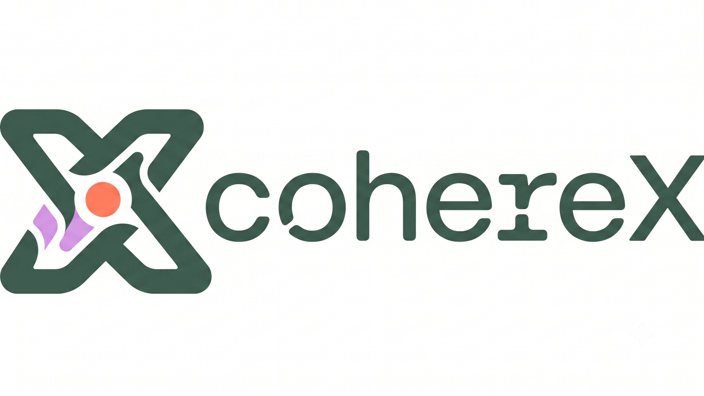

<p align="center">
  
</p>

<p align="center">
  <a href="https://colab.research.google.com/github/bakrianoo/cohereX/blob/main/notebooks/coherex_colab.ipynb"></a>
</p>

# CohereX

Speech transcription with word-level timestamps and speaker diarization, built on the
[Cohere Transcribe](https://huggingface.co/CohereLabs/cohere-transcribe-03-2026) ASR model.

Cohere Transcribe produces accurate text but no timestamps, no speaker labels, and no
language detection. CohereX adds those around it, reusing the
[WhisperX](https://github.com/m-bain/whisperX) pipeline design.

## Features

- Word-level timestamps from wav2vec2 forced alignment
- Speaker labels per word and segment (pyannote diarization)
- Voice activity detection (pyannote or silero) that drops silence before transcription
- 14 languages, with optional automatic detection
- Output as SRT, VTT, TXT, TSV, or JSON
- Runs the model in-process or offloads it to a vLLM server

Pipeline:

```
audio → VAD → Cohere Transcribe → wav2vec2 forced alignment → diarization → subtitles
```

## Requirements

- Python 3.10–3.13
- [FFmpeg](https://ffmpeg.org/) on your PATH (used for audio decoding)
- A Hugging Face account with access to the gated models:
  - [`CohereLabs/cohere-transcribe-03-2026`](https://huggingface.co/CohereLabs/cohere-transcribe-03-2026)
  - [`CohereLabs/cohere-transcribe-arabic-07-2026`](https://huggingface.co/CohereLabs/cohere-transcribe-arabic-07-2026) (only if you use the Arabic/English finetuned model)
  - [`pyannote/speaker-diarization-community-1`](https://huggingface.co/pyannote/speaker-diarization-community-1) (only if you use `--diarize`)

Accept the model terms on their Hugging Face pages, then log in:

```bash
hf auth login
```

## Install

```bash
pip install coherex
```

For automatic language detection, include the optional extra:

```bash
pip install "coherex[langid]"
```

To enable everything (language detection and the vLLM backend), use:

```bash
pip install "coherex[all]"
```

To work from source instead:

```bash
git clone https://github.com/bakrianoo/cohereX.git
cd cohereX
pip install -e .
```

GPU is strongly recommended. On CPU the model runs but is slow.

## Quick start

Transcribe a file and write all output formats to `out/`:

```bash
coherex audio.mp3 --language en -o out/
```

Add speaker labels:

```bash
coherex audio.mp3 --language en --diarize -o out/
```

Let CohereX detect the language (needs the `langid` extra):

```bash
coherex audio.mp3 --language auto -o out/
```

Produce only an SRT with two lines per cue:

```bash
coherex audio.mp3 --language en -f srt --max_line_width 42 --max_line_count 2 -o out/
```

`--language` is required. Cohere Transcribe has no built-in language detection, and passing
the wrong language produces a fluent but wrong transcription rather than an error. Use `auto`
if you are unsure.

## Supported languages

`en`, `fr`, `de`, `es`, `it`, `pt`, `nl`, `pl`, `el`, `ar`, `ja`, `zh`, `vi`, `ko`.

Automatic detection (`--language auto`) chooses from this set only.

## Models

By default CohereX uses [`CohereLabs/cohere-transcribe-03-2026`](https://huggingface.co/CohereLabs/cohere-transcribe-03-2026)
(14 languages). Pass `--model` to use a different Cohere ASR model.

For Arabic, English, and Arabic-English code-switched audio, the finetuned
[`CohereLabs/cohere-transcribe-arabic-07-2026`](https://huggingface.co/CohereLabs/cohere-transcribe-arabic-07-2026)
is more accurate:

```bash
coherex audio.mp3 --model CohereLabs/cohere-transcribe-arabic-07-2026 --language ar -o out/
```

CohereX reads the supported languages from the model itself, so `--language` is validated
against whatever the chosen model accepts (`en`, `ar` for the Arabic model), and
`--language auto` only probes those.

## Serving with vLLM

By default the ASR model runs in-process (`--backend local`). For higher throughput you can
run transcription on a [vLLM](https://docs.vllm.ai) server instead (`pip install "coherex[vllm]"`).
Alignment and diarization still run locally either way.

Point CohereX at a server you already run:

```bash
coherex audio.mp3 --language en --backend vllm --vllm_url http://localhost:8000
```

Or let **CohereX start its own vLLM** server and shut it down automatically when the run finishes:

```bash
coherex audio.mp3 --language en --backend vllm
```

Add `--vllm_api_key` if the server requires one, and `--vllm_args` to pass extra
`vllm serve` flags (e.g. `--vllm_args "--gpu-memory-utilization 0.8"`).

## Common options

| Option | Default | Description |
| --- | --- | --- |
| `--language` | — | Language code or `auto`. Required. |
| `--diarize` | off | Assign speaker labels (needs the pyannote model + token). |
| `--no_align` | off | Skip forced alignment (segment-level timestamps only). |
| `--device` | `cuda` if available | `cpu` or `cuda`. |
| `--compute_type` | `default` | `bfloat16`, `float16`, `float32`, or `default` (bfloat16 on GPU, float32 on CPU). |
| `--batch_size` | `8` | VAD chunks per forward pass. Helps on GPU; use `1` on CPU. |
| `--vad_method` | `pyannote` | `pyannote` or `silero`. |
| `--chunk_size` | `30` | Max seconds per VAD chunk. Keep below 35. |
| `--backend` | `local` | `local` (in-process) or `vllm` (see [Serving with vLLM](#serving-with-vllm)). |
| `--output_format` / `-f` | `all` | `srt`, `vtt`, `txt`, `tsv`, `json`, `aud`, or `all`. |
| `--output_dir` / `-o` | `.` | Where to write outputs. |
| `--punctuation` | `true` | Set `false` for lower-cased output without punctuation. |
| `--max_line_width` | none | Max characters per subtitle line. |
| `--max_line_count` | none | Max lines per subtitle cue. |
| `--min_speakers` / `--max_speakers` | none | Constrain the speaker count for diarization. |
| `--hf_token` | none | Hugging Face token (or use `hf auth login`). |

Run `coherex --help` for the full list.

## Python API

```python
import coherex

model = coherex.load_model(device="cuda", compute_type="bfloat16", vad_method="pyannote")

# 1. Transcribe (segment-level timestamps from VAD)
result = model.transcribe("audio.mp3", language="en", batch_size=8)

# 2. Word-level timestamps
align_model, metadata = coherex.load_align_model("en", device="cuda")
result = coherex.align(result["segments"], align_model, metadata, "audio.mp3", "cuda")

# 3. Speaker labels
from coherex.diarize import DiarizationPipeline
diarizer = DiarizationPipeline(device="cuda")
speakers = diarizer("audio.mp3")
result = coherex.assign_word_speakers(speakers, result)

for seg in result["segments"]:
    print(seg["start"], seg["end"], seg.get("speaker"), seg["text"])
```

To detect the language from audio:

```python
model = coherex.load_model(device="cuda")
language = coherex.detect_language(model, "audio.mp3")
result = model.transcribe("audio.mp3", language=language)
```

## Output

JSON contains segments and a flat `word_segments` list, each word carrying `start`, `end`,
`score`, and (with `--diarize`) `speaker`:

```json
{
  "segments": [
    {
      "start": 0.83,
      "end": 6.33,
      "text": "This week, I traveled to Chicago...",
      "speaker": "SPEAKER_00",
      "words": [
        {"word": "This", "start": 0.83, "end": 1.01, "score": 0.98, "speaker": "SPEAKER_00"}
      ]
    }
  ],
  "word_segments": [
    {"word": "This", "start": 0.83, "end": 1.01, "score": 0.98, "speaker": "SPEAKER_00"}
  ],
  "language": "en"
}
```

## Notes and limitations

- **Language is required.** There is no reliable failure mode for the wrong language — the
  model will transcribe confidently in whatever language you specify.
- **VAD matters.** Cohere Transcribe transcribes non-speech audio as hallucinated text, so
  the VAD step is on by default and should stay on for noisy input.
- **14 languages only**, listed above.
- **Alignment coverage.** Word timestamps come from a per-language wav2vec2 model. If none is
  available for a language, run with `--no_align` to get segment-level timestamps instead.
- **`auto` detection cost.** It probes the model once per candidate language, so it is slower
  than passing a code directly. Prefer an explicit `--language` when you know it.

## How it fits together

Only the ASR-specific pieces are unique to CohereX:

- `asr.py` — loads Cohere Transcribe and transcribes VAD chunks.
- `transcribe.py` — the end-to-end pipeline.
- `langid.py` — optional language detection.
- `__main__.py` — the command-line interface.

Alignment (`alignment.py`), diarization (`diarize.py`), VAD (`vads/`), subtitle formatting
(`SubtitlesProcessor.py`), and the output writers (`utils.py`) follow WhisperX.

## Credits

- [Cohere Transcribe](https://huggingface.co/CohereLabs/cohere-transcribe-03-2026) — the ASR model.
- [WhisperX](https://github.com/m-bain/whisperX) — the pipeline design and the alignment,
  diarization, VAD, and subtitle components.
- [pyannote.audio](https://github.com/pyannote/pyannote-audio) — VAD and diarization.

## License

Apache 2.0.
